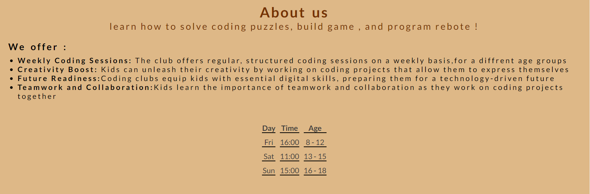
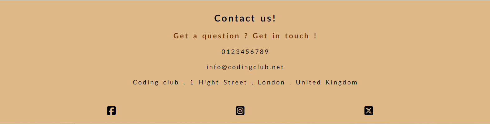
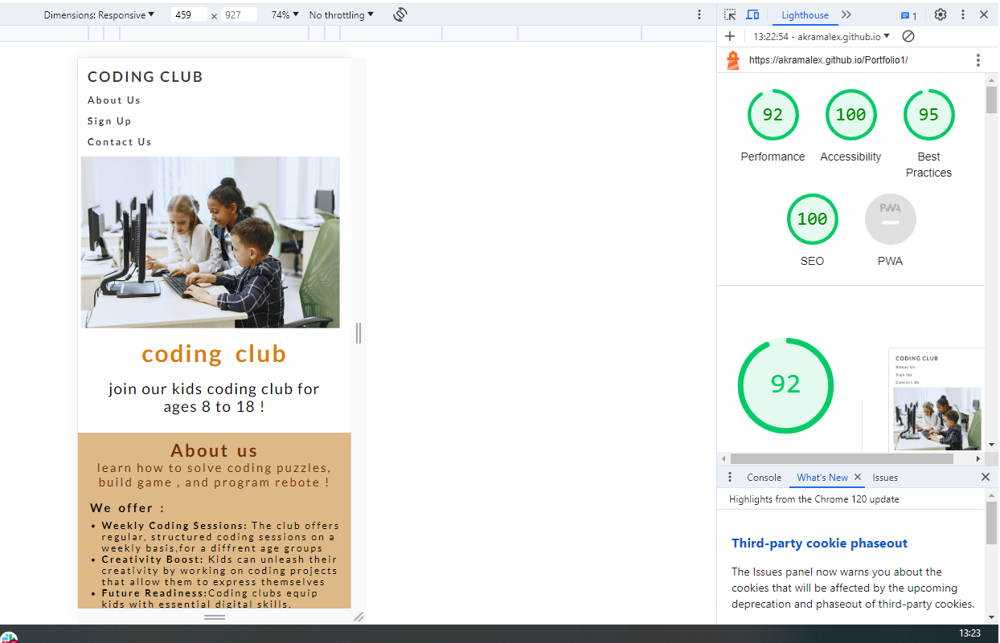

# Codeing Club

## Welcome ! [View the live project here .](https://akramalex.github.io/Portfolio1/)

The Coding Clube website is a landing page for parents and children looking for a fun coding club for kids aged 8 to 18. 
The Coding Clube offers fun activites for kids to lear how to code from a young age.

User for this website wil be able to find all the information they need to know about Coding Club.
meeting times , pricing , contact informtaion and sign up form , This site is trageted towards parents of children who want to learn to code.

## Features

  * Navigation
  
  
      - Featured at the top of the page , the navigttion shows the clube name in the left corner :CODING CLUBE that 
  links to the top of the page.
  
      - The other navigation links are to the right About us , Sign up and Contact us which link to differen sections of the same page.
  
     -  The Navigation is in a front that looks like code , and a color that contrasts with the background.
  
     -  the navigation clearly tells the user the name of the club and the website and makes the diffrenet section of information easy to find .
  
  

     

* The header 

  * The header shows the name of the club , using the other color chosen : dark orange and continuing the computre code font theme.
  
  * The header explaing the club is for kids aged 8 to 18.
  
  * This section provides the user with clear information about what the site is and who the clube it is for.
  
  

* The About Us 

    - The About us section gives details about what the club offers their members , and has a table with the club meeting time.
  
    - This seciion shows the user the important information they need to know  about the club : what they offer and when they are open for different age groups.
  
  

*  The Sign up Form 
     - The sign up section has a form to collect details from parents to they can sign up to the coding club.
  
     - The Form collects the child's name , and Child's age , and parent/guardian's name , and an email address.
  
     - The sign up form is valuable to the user as it gives them the ability to sign up to join the Coding Club .
  
     

* The Contact Us section

    - The contact us section encourages users to get in contact and provides a phone number , email address and street address where they can be found.
  
    - The contact section inculdes social media icons to users can find the coding club on facebook , X and instagram.
  
    - The contact section is valuable to the user as it gives them the ability to find and contact the Coding Clube if they need to.
  
   

## Testing 

 * I teated that this page works in different browsers Chrome , Firefox , Safari , Internet Explroer.
  
 * I confirmed that this project is responsive , looks good and functions on all standard screen sizes use the devtools and device toolbar.
 * I confirmed that the navigation header, about us , sign up , and contact text are all readable and easy to understand.
 * I have confiremd that the form works , requires entries in every field, will only accept an email in the email field.

## bugs
### Solved bugs 
 
* When i deployed my project to GitHub pages i discovered my project was broken, the links to the other file (images) did not work.
  
* i discovered this was because i had used wrong file paths althought was relative.
 

## validator Testing
 * HTML
  
    - No errors were returned when passing throught officail W3C walidator.

* CSS 
  
    -No errors were found when passing through the official (jigsaw)validator.

* Accessibility 
      -i confirmed that the colors and fonts chosen are easy to read and accessible by runing it through light house in devtools.

