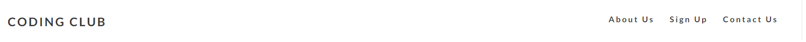

# Codeing Club

## Welcome ! [View the live project here .](https://akramalex.github.io/Portfolio1/)

The Coding Clube website is a landing page for parents and children looking for a fun coding club for kids aged 8 to 18. 
The Coding Clube offers fun activites for kids to lear how to code from a young age 

User for this website wil be able to find all the information they need to know about Coding Club.
meeting times , pricing , contact informtaion and sign up form , This site is trageted towards parents of children who want to learn to code 

## Features

  * Navigation
      - Featured at the top of the page , the navigttion shows the clube name in the left corner :CODING CLUBE that 
  links to the top of the page.
   - The other navigation links are to the right About us , Sign up and Contact us which link to differen sections of the same page.
     -  The Navigation is in a front that looks like code , and a color that contrasts with the background.
     -  the navigation clearly tells the user the name of the club and the website and makes the diffrenet section of information easy to find .
  
     

* The header section

  * A
  * B
  * C
  * screen shot

* The about us section

    - A
    - B
    - C
    - screen shot
*  the sign up form 
     - A
     - B
     - C
     -  screen shot

* the contact us section
    - A
    - B
    - C
    - Screen shot

## Testing 
 * item1

## bugs

## validator Testing
 * HTML
      - NO /YES

* CSS 
    -NO/YES

* Accessibility 
      -i confirmed or no
screen shot of lighthouse